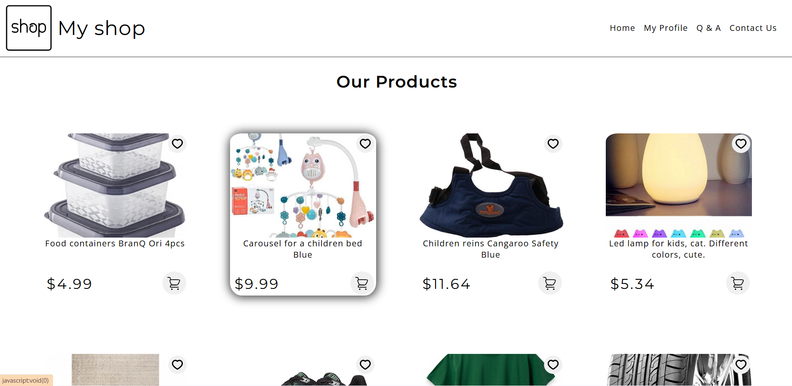

# Product Cards with CSS Grid

A simple project showcasing a set of product cards built using **HTML** and **CSS Grid**.  
Each card includes a title, description, price, and call-to-action button.  
The main focus of this project is practicing CSS Grid and creating a clean, responsive layout.
Also I want to say that in this project I used SVGs. Tbh, they own 90% of my html code :)

## Features
- Responsive card layout  
- CSS Grid for positioning  
- Minimal and clean design  

## Technologies
- HTML5  
- CSS3 (CSS Grid)

## Preview


## Setup
1. Clone the repository:
   ```bash
   git clone https://github.com/Mihasik556/Product-cards.git

2. Launch index.html in your browser.
